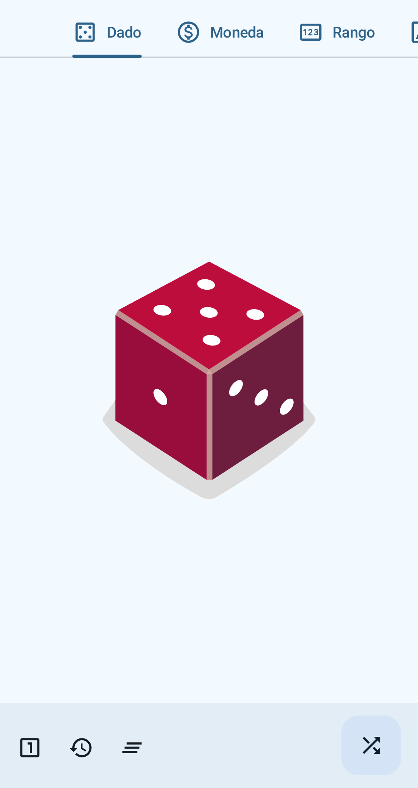
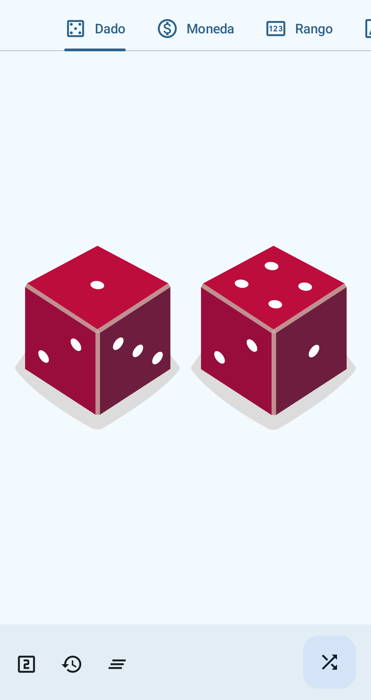
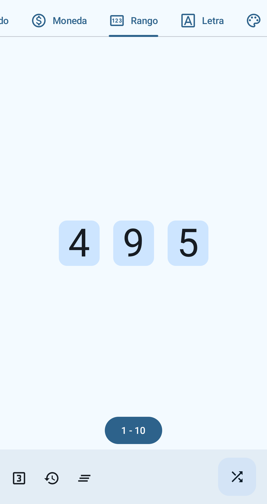
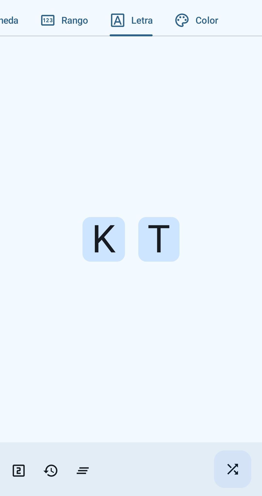
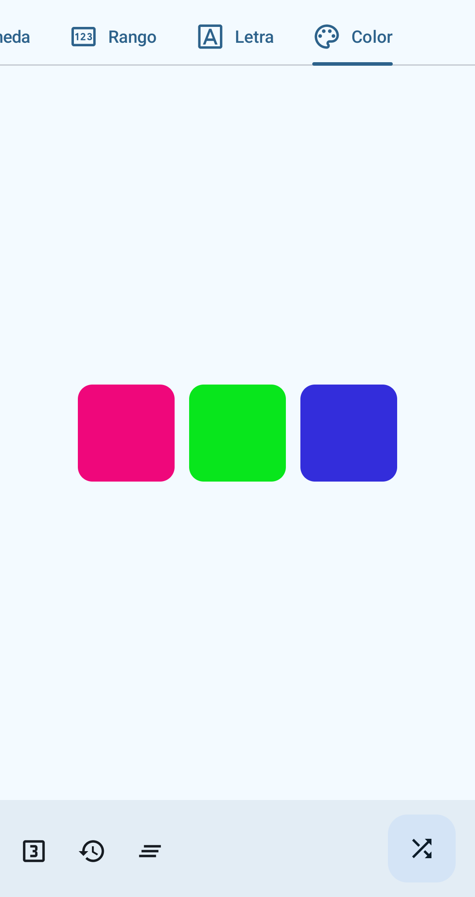

# Azar

Una aplicación para tirar dados, monedas y obtener números aleatorios de forma sencilla.

Está escrita en Jetpack Compose con Material Design 3 y color dinámico.

## 📝 Idiomas

* Español
* Inglés
* Francés
* Italiano

## 📸 Capturas

    
    
    
    
    
    

## 📲 Instalación

